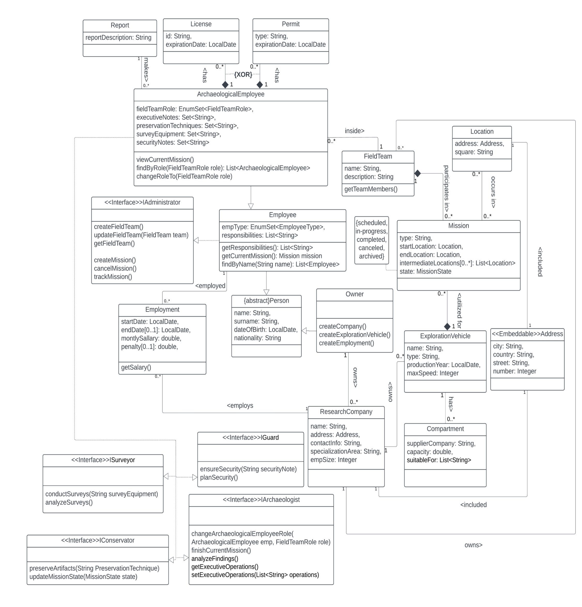
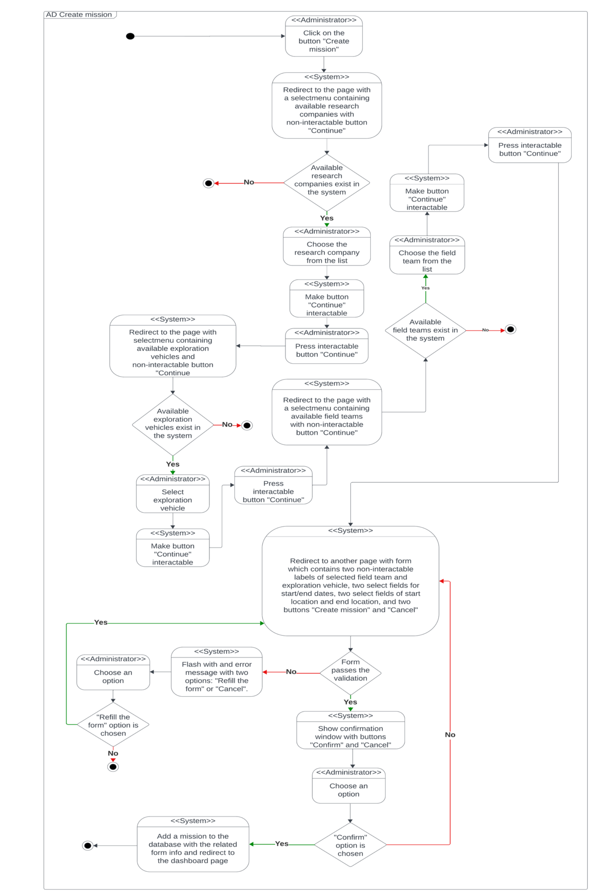

# Archaeological Mission Management System

This repository contains an implementation of an Archaeological Mission Management System using Java Spring Boot, Hibernate, and React. The main use case implemented is "Create Mission."

## Table of Contents
- [Introduction](#introduction)
- [Technologies Used](#technologies-used)
- [System Architecture](#system-architecture)
- [Setup and Installation](#setup-and-installation)
- [Usage](#usage)
- [Endpoints](#endpoints)
- [Database Schema](#database-schema)
- [Diagrams](#diagrams)
- [Contributing](#contributing)
- [License](#license)

## Introduction
This project aims to manage archaeological missions, involving various entities such as employees, field teams, missions, locations, and more. The system allows users to create and manage missions, assign teams, and track mission progress.

## Technologies Used
- **Backend:**
    - Java Spring Boot
    - Hibernate (JPA)
- **Frontend:**
    - React
    - Node.js (used for building the React application)
- **Database:**
    - H2 (for development)
    - PostgreSQL/MySQL (for production)

## System Architecture
The application follows a monolithic architecture with a clear separation between the frontend and backend. The backend is implemented in Java Spring Boot with Hibernate for ORM. The frontend is developed using React, and Node.js is used to build the React application.

## Setup and Installation

### Prerequisites
- Java 11 or higher
- Node.js and npm
- Maven
- PostgreSQL/MySQL (for production)

### Backend Setup
1. Clone the repository:
   git clone https://github.com/yourusername/archaeological-mission-management.git
   cd archaeological-mission-management

2. Navigate to the `backend` directory:
   cd backend

3. Install dependencies and build the project:
   mvn clean install

4. Run the Spring Boot application:
   mvn spring-boot:run

### Frontend Setup
1. Navigate to the `frontend` directory:
   cd frontend

2. Install dependencies:
   npm install

3. Build the React application:
   npm run build

Alternatively, you can use the Gradle task configured to build the React application:

task buildReactApp(type: NodeTask, dependsOn: 'npmInstall') {
script = project.file('node_modules/webpack/bin/webpack.js')
args = [
'--mode', 'development',
'--entry', './src/main/webapp/javascript/Main.jsx',
'-o', './src/main/resources/static/'
]
}

To run this task, execute:
gradle buildReactApp

## Usage
Once both the backend and frontend are running, you can access the application by navigating to `http://localhost:8080` in your web browser.

### Creating a Mission
To create a mission, navigate to the "Create Mission" page in the application. Fill out the required fields and submit the form.

## Endpoints
- `GET /api/missions/current` - Retrieve all current missions
- `GET /api/missions/archived` - Retrieve all archived missions
- `GET /api/missions/find_by_id/{id}` - Retrieve a mission by ID
- `POST /api/missions/create` - Create a new mission

## Database Schema
The database schema is defined using JPA annotations in the entity classes. An H2 database is used for development, and PostgreSQL/MySQL is recommended for production. The schema includes tables for employees, field teams, missions, locations, and other related entities.

## Diagrams

### UML Diagram
The class diagram below provides an overview of the system's design:

### Activity Diagram
The activity diagram for the "Create Mission" use case illustrates the flow of activities involved in creating a mission:

## Contributing
Contributions are welcome! Please open an issue or submit a pull request for any improvements or bug fixes.

## License
This project is licensed under the MIT License. See the [LICENSE](LICENSE) file for details.
